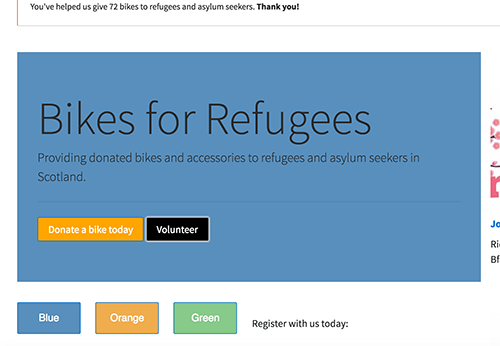

# For homework:
 
### Part 1

Open `index.html` in your browser. Notice there are 3 buttons: blue, orange and green.
Edit the file `.js/main.js` and add the following functionality:

Clicking on the buttons should change the "theme" of the website:

- When clicking **blue** it should change:
        - **Jumbotron** background color to `#588fbd`
        - **Donate a bike** button background color to `#ffa500`
        - **Volunteer** button background color to `black` and text color to `white`
- When clicking **orange** it should change:
        - **Jumbotron** background color to `#f0ad4e`
        - **Donate a bike** button background color to `#5751fd`
        - **Volunteer** button background color to `#31b0d5` and text color to `white`
- When clicking **green** it should change:
        - **Jumbotron** background color to `#87ca8a`
        - **Donate a bike** button background color to `black`
        - **Volunteer** button background color to `#8c9c08`

Here's an example of how the website should look for the blue button:

 
### Part 2

Just below the buttons, there's a form called **Register with us**.

Continue working in `./js/main.js` to add the following functionality:

When the submit button is pressed, it should check that all the form fields are valid:
- The **Your name**, **Email** and **Describe yourself** fields need to be non-empty (Hint: their `value` length has to be greater than zero)
- For the **Email** field also check if it contains the `@` character

For all the fields that invalid, it should make their background color `red`.
IF all the fields are valid, when you click **Submit** it should:
- Display an alert to thank you for filling out the form
- Blank out (make empty) all the text fields

**Important hint:** In your function that handles clicks on the `Submit` button you will need to call `event.preventDefault()` to stop the browser from refreshing the page. To read more on how to do this: https://developer.mozilla.org/en/docs/Web/API/Event/preventDefault 